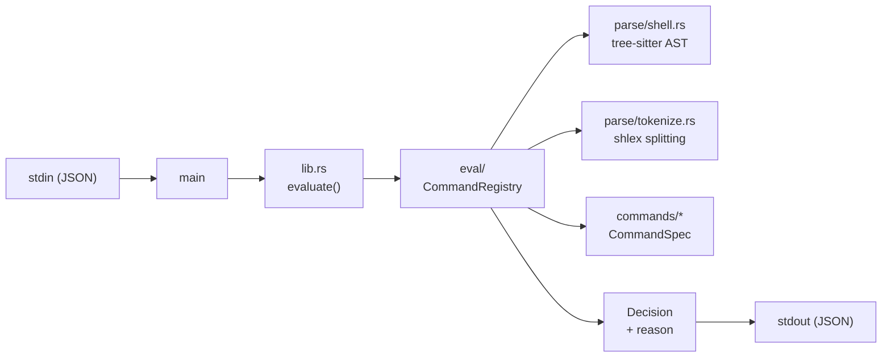
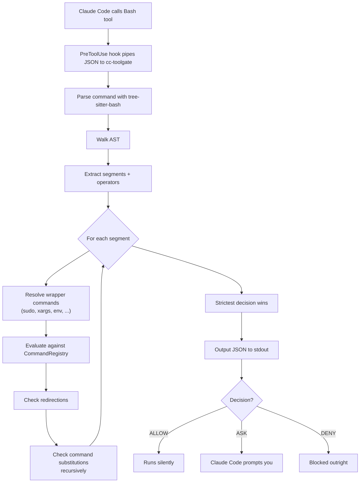
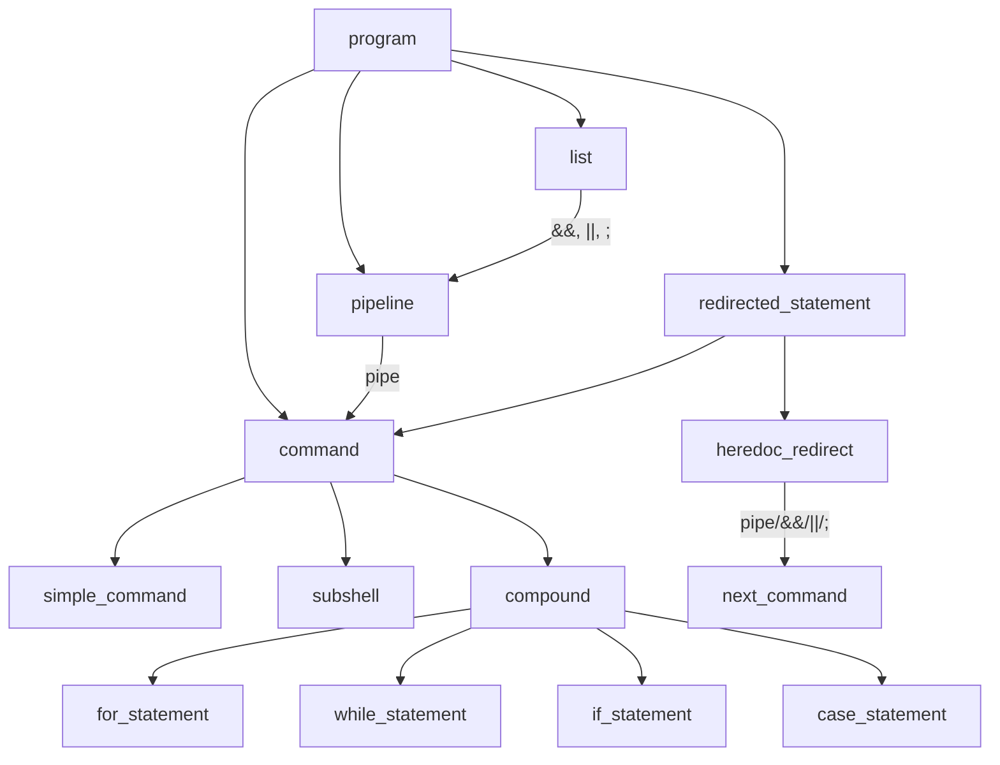

# cc-toolgate

A [PreToolUse hook](https://docs.anthropic.com/en/docs/claude-code/hooks) for Claude Code that gates Bash commands before execution. Every command Claude wants to run is parsed, classified, and either allowed silently, prompted for confirmation, or denied outright.

## Why

Claude Code can run arbitrary shell commands. That's powerful but dangerous — a misguided `rm -rf`, an unauthorized `kubectl apply`, or a `sudo` invocation shouldn't happen without your say-so. cc-toolgate sits between Claude and the shell, evaluating every command against configurable rules.

## Decision model

Every command gets one of three decisions:

| Decision | Behavior | When |
|----------|----------|------|
| **ALLOW** | Runs silently | Read-only commands, safe tools (`ls`, `git status`, `cargo build`) |
| **ASK** | Claude Code prompts you | Mutating commands (`rm`, `git push`), unrecognized commands |
| **DENY** | Blocked outright | Destructive commands (`shred`, `dd`, `mkfs`) |

Redirection on allowed commands (e.g. `echo foo > file.txt`) automatically escalates to ASK.

## Architecture

cc-toolgate uses a tree-sitter-bash parser to build a full AST of the command, then walks it to extract segments, operators, substitutions, and redirections for evaluation.



### Module layout

```
src/
  main.rs           Entry point, CLI flags (84 lines)
  lib.rs            Re-exports, top-level evaluate() orchestrator
  config.rs         TOML config loading, ConfigOverlay merge system
  parse/
    mod.rs          Re-exports
    shell.rs        tree-sitter-bash AST walker: compound splitting,
                    substitution extraction, redirection detection
    tokenize.rs     shlex-based word splitting, base_command(), env_vars()
    types.rs        ParsedPipeline, ShellSegment, Operator, Redirection
  eval/
    mod.rs          CommandRegistry, strictest-wins aggregation
    context.rs      CommandContext struct
    decision.rs     Decision enum, RuleMatch
  commands/         CommandSpec implementations per tool category
    simple.rs       Flat allow/ask/deny lists
    deny.rs         Always-deny commands (shred, dd, mkfs, etc.)
    git.rs          Subcommand-aware git evaluation
    cargo.rs        Subcommand-aware cargo evaluation
    kubectl.rs      Subcommand-aware kubectl evaluation
    gh.rs           Subcommand-aware gh CLI evaluation
  logging.rs        File appender for decision log
tests/
  integration.rs    219 integration tests (decision_test! macro)
config.default.toml Embedded default config
```

## How it works



### Command parsing

cc-toolgate uses [tree-sitter-bash](https://github.com/tree-sitter/tree-sitter-bash) to parse commands into a full AST before evaluation. This replaced an earlier hand-rolled parser and fixes a class of bugs around heredocs, nested quoting, and operator extraction.

The AST walker handles these node types:



Key behaviors:
- **Heredoc pipes**: `cat <<'EOF' | kubectl apply -f -` correctly identifies both the `cat` and `kubectl apply` segments
- **Command substitutions**: `$(...)` and backticks are recursively evaluated; single-quoted strings are not expanded
- **Process substitutions**: `<(...)` and `>(...)` are recognized without false redirection detection
- **/dev/null**: Redirections to `/dev/null` don't escalate (they're non-mutating)
- **fd duplication**: `2>&1`, `>&2` are safe; `>&3` escalates (could write to a file)

### Wrapper commands

Commands that execute their arguments (like `sudo`, `xargs`, `env`) are evaluated recursively. The wrapped command is extracted and evaluated, and the final decision is the stricter of the wrapper's floor and the inner command's decision.

```
sudo rm -rf /        → max(ask_floor, ask) = ASK
sudo shred /dev/sda  → max(ask_floor, deny) = DENY
xargs grep foo       → max(allow_floor, allow) = ALLOW
env FOO=bar rm file  → max(allow_floor, ask) = ASK
```

### Compound commands

Compound expressions are split and each part evaluated independently:

```
git status && rm -rf /tmp/stuff    → max(allow, ask) = ASK
echo hello | kubectl apply -f -   → max(allow, ask) = ASK
```

## Installation

Build from source (requires Rust 2024 edition, i.e. rustc 1.85+):

```bash
cargo build --release
```

The binary is at `target/release/cc-toolgate`.

### Hook configuration

Add to `~/.claude/settings.json`:

```json
{
  "hooks": {
    "PreToolUse": [
      {
        "matcher": "Bash",
        "hooks": [
          {
            "type": "command",
            "command": "/path/to/cc-toolgate",
            "timeout": 5
          }
        ]
      }
    ]
  }
}
```

## Configuration

cc-toolgate ships with sensible defaults embedded in the binary. Override any part by creating `~/.config/cc-toolgate/config.toml`.

### Merge behavior

User config **merges** with defaults — you only specify what you want to change:

- **Lists** extend defaults (deduplicated)
- **Scalars** override defaults
- **`remove_<field>`** subtracts items from default lists
- **`replace = true`** in any section replaces defaults entirely for that section

### Example user config

```toml
# Move source/. from allow to ask (they execute arbitrary code)
[commands]
remove_allow = ["source", "."]
ask = ["source", "."]

# Auto-allow git push/pull when using a separate AI gitconfig
[git]
allowed_with_config = ["push", "pull", "add", "commit"]
config_env_var = "GIT_CONFIG_GLOBAL"

# Remove cargo run from safe subcommands (it executes arbitrary code)
[cargo]
remove_safe_subcommands = ["run"]
```

### Inspecting effective config

```bash
cc-toolgate --dump-config        # TOML output
cc-toolgate --dump-config json   # JSON output
```

### Escalate deny

Pass `--escalate-deny` to turn all DENY decisions into ASK. Useful when you trust the operator but want visibility:

```json
{
  "command": "/path/to/cc-toolgate --escalate-deny",
  "timeout": 5
}
```

## Command categories

### Simple commands (allow / ask / deny)

Flat name-to-decision mapping. See `config.default.toml` for the full default lists.

### Complex command specs

`git`, `cargo`, `kubectl`, and `gh` have subcommand-aware evaluation with read-only vs. mutating distinctions, flag analysis, and optional env-gated auto-allow.

### Wrapper commands

Commands in the `[wrappers]` section execute their arguments as subcommands. Each has a floor decision:

- **`allow_floor`**: `xargs`, `parallel`, `env`, `nohup`, `nice`, `timeout`, `time`, `watch`, `strace`, `ltrace`
- **`ask_floor`**: `sudo`, `su`, `doas`, `pkexec`

## Testing

### Running tests

```bash
cargo test              # Run all 337 tests (118 unit + 219 integration)
cargo test --lib        # Unit tests only
cargo test --test integration  # Integration tests only
```

[cargo-nextest](https://nexte.st/) is recommended for faster parallel execution and better output:

```bash
cargo nextest run       # All tests
cargo nextest run -E 'test(heredoc)'  # Filter by name pattern
```

### Test structure

- **Unit tests** (118): Colocated in `src/` modules with `#[cfg(test)]`. These test internal parsing and evaluation logic and need `super::*` access to private helpers.
- **Integration tests** (219): In `tests/integration.rs`. These test end-to-end command evaluation through the public API.

### Adding tests

Most integration tests use the `decision_test!` macro for one-line declarations:

```rust
decision_test!(test_name, "command string", ExpectedDecision);
// e.g.
decision_test!(allow_git_log, "git log --oneline", Allow);
decision_test!(ask_rm, "rm -rf /tmp", Ask);
decision_test!(deny_shred, "shred /dev/sda", Deny);
```

For tests that need reason assertions, custom registries, or multi-line heredoc commands, write a full `#[test] fn` block.

## Contributing

### Project structure at a glance

1. **Adding a new command rule**: Edit `config.default.toml` to add it to the appropriate list, or add a new `CommandSpec` under `src/commands/`.
2. **Adding a new complex command**: Create a new file in `src/commands/`, implement `CommandSpec`, and register it in `src/eval/mod.rs`.
3. **Parser changes**: Modify `src/parse/shell.rs` (tree-sitter AST walker) or `src/parse/tokenize.rs` (shlex tokenizer).
4. **Adding a test**: Add a `decision_test!()` line to `tests/integration.rs` under the appropriate section.

### Build requirements

- Rust 2024 edition (rustc 1.85+)
- A C compiler (for tree-sitter-bash; cc crate handles this automatically)

## Logging

Decisions are logged to `~/.local/share/cc-toolgate/decisions.log` (one line per evaluation).

## License

MIT
